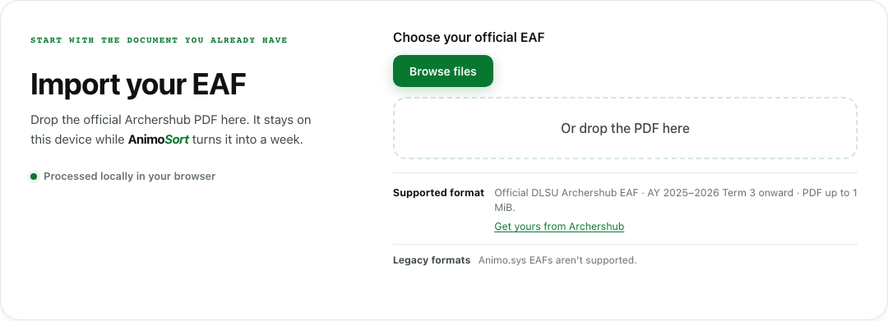
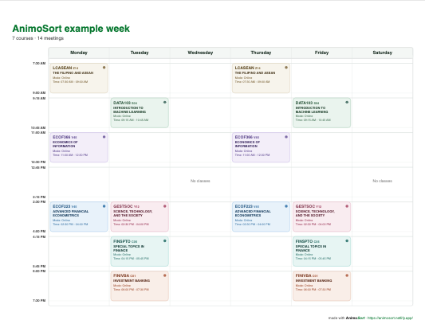
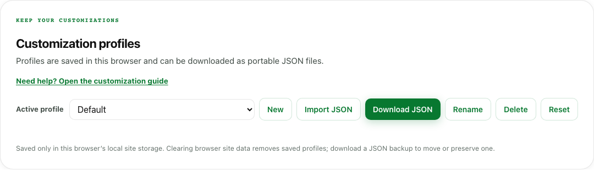
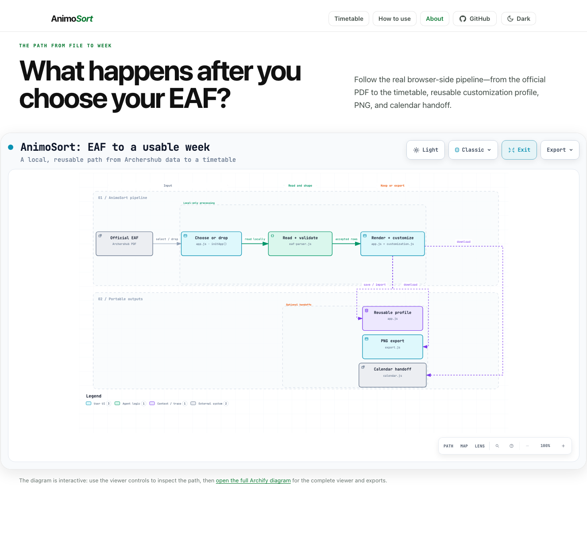

# AnimoSort

AnimoSort is a client-side web application that converts De La Salle University Enrollment Assessment Form PDFs into a clean weekly timetable. The application runs entirely within the browser, ensuring student schedule data remains private and is never transmitted over a network.

Open the [hosted AnimoSort app](https://animosort.netlify.app/), read the [How to use guide](how-to-use.html), or open the [About page and interactive EAF-to-week pipeline](about.html#pipeline). The complete release history is in the [changelog](CHANGELOG.md).

## Why does this exist?

The EAF already contains the schedule.

Archershub’s Schedule page can leave a timetable-sized blank with **“Time Table has not been Created.”** Even when rows appear, they may arrive in received order rather than chronological order. The official EAF generated by the same platform already contains the subjects, sections, meeting days, times, rooms, and modalities needed to create the week.

AnimoSort reads that EAF locally, normalizes the meeting rows, sorts them by their actual start times, and renders a Monday–Saturday timetable. The [About page](about.html) shows the supplied Archershub output, the source receipt, and the generated result side by side.

The privacy boundary is deliberately small:

- The PDF is processed entirely in the browser and is never uploaded.
- No account, parsing backend, telemetry, or AI service receives enrollment data.
- Student ID and tuition information are not displayed.
- The tool is independent and is not affiliated with, endorsed by, or part of DLSU or Archershub.

Read the [How to use guide](how-to-use.html) for profile, PNG, and calendar workflows. The implementation path is documented in the [interactive Archify pipeline](about.html#pipeline).

## Screenshots

These screenshots are captured from the current site and focus on the product itself: importing locally, seeing the generated timetable, saving presentation choices, and inspecting the code path. For step-by-step profile and calendar instructions, use the [How to use guide](how-to-use.html#customization-profiles) and its [Google Calendar section](how-to-use.html#google-calendar).

| Import locally | Timetable output |
| --- | --- |
|  |  |

| Customization profiles | Interactive architecture pipeline |
| --- | --- |
|  |  |

## Core Features

- Client-side PDF parsing with vendored PDF.js
- Automatic term detection and course schedule extraction
- Campus building code expansions for physical classrooms (including Velasco Hall, LS Hall, Miguel Hall, etc.)
- Customizable course colors with pastel presets, monochrome plain mode, direct `#HEX` code input, and one-click randomize
- Named customization profiles with local persistence and portable JSON import/export
- Section-level F2F/Online overrides and optional professor labels
- AMOLED dark mode with dedicated header theme toggle
- Support for non-standard meeting intervals and split room allocations
- Toggle controls for full course titles
- High-resolution theme-aware PNG timetable export
- Zero telemetry and zero external server dependencies

## Compatibility

AnimoSort supports official DLSU Enrollment Assessment Forms generated from [Archershub](https://archershub.dlsu.edu.ph/) starting from AY 2025-2026 Term 3. Legacy documents from Animo.sys are unsupported.

## Quickstart

Because AnimoSort is a static web application with no build steps, you can serve it with any local static web server.

```bash
# Clone the repository
git clone https://github.com/sakudiff/Animo-Sort.git
cd Animo-Sort

# Start a local static server
python3 -m http.server 8000
```

Open `http://localhost:8000` in your web browser to use the application.

## Usage

1. Open AnimoSort in your browser.
2. Select or drag your official Archershub EAF PDF into the upload area.
3. Review your timetable across Monday to Saturday.
4. Click a timetable card or color dot to set a course color, delivery mode, and optional professor.
5. Use the profile panel to create, rename, reset, download, or import a customization profile. Profiles are browser-local; the JSON file contains customization values only.
6. Toggle full course titles, choose the PNG theme, or download a PNG image of your schedule.

See [How to use AnimoSort](how-to-use.html) for the complete walkthrough.

## Project Structure

```
.
├── assets/
│   ├── animosort-workflow.html                 # Archify desktop diagram viewer
│   ├── animosort-workflow-mobile.html          # Archify narrow-screen viewer
│   ├── animosort-workflow.workflow.json        # Archify desktop source spec
│   ├── animosort-workflow-mobile.workflow.json # Archify mobile source spec
│   ├── images/
│   │   ├── archershub-schedule-example.png     # Source receipt used on About
│   │   ├── animosort-import-panel.png          # README screenshot
│   │   ├── animosort-timetable-output.png       # README screenshot
│   │   ├── animosort-customization-panel.png    # README screenshot
│   │   └── animosort-about-pipeline.png        # README screenshot
│   └── js/
│       ├── app.js           # Application controller and UI interactions
│       ├── customization.js # Profile schema, persistence, resolver, and resets
│       ├── eaf-parser.js    # PDF extraction, parsing, and room mapping
│       ├── export.js        # SVG layout and PNG image generation
│       └── site.js          # Shared theme, navigation, and reveal behavior
├── vendor/
│   └── pdfjs/              # Vendored PDF.js library builds
├── index.html              # Application markup and structure
├── how-to-use.html         # User guide
├── styles.css              # Typography, layout, and component styling
├── print.css               # Print media rules
├── netlify.toml            # Netlify deployment configuration
├── package.json            # Project metadata
├── .gitignore              # Ignored files and directories
└── README.md
```

## Architecture

The project is structured into vanilla JavaScript modules.

- `assets/js/eaf-parser.js` handles PDF text extraction, schedule row identification, zero-credit course support, and campus room translations.
- `assets/js/customization.js` validates the versioned profile format, migrates legacy colors, stores named profiles locally, and resolves course/section presentation values.
- `assets/js/export.js` generates vector SVG representations and exports high-resolution timetable images.
- `assets/js/app.js` manages DOM event bindings, drag-and-drop file ingestion, timetable rendering, and client-side view toggles.
- `assets/js/site.js` provides the shared theme toggle, navigation state, smooth scrolling, and reveal behavior used by both pages.

### Interactive pipeline diagram

The [About page pipeline](about.html#pipeline) documents the browser-side path from an official EAF to a timetable and its portable outputs. It is rendered with [Archify](https://github.com/tt-a1i/archify) and includes separate horizontal and vertical viewers so the same explanation remains usable on desktop and narrow screens. The diagram names the actual modules and functions involved in parsing, rendering, customization profiles, PNG export, and `.ics` calendar handoff.

The generated [desktop viewer](assets/animosort-workflow.html) and [mobile viewer](assets/animosort-workflow-mobile.html) are self-contained static artifacts. Their companion `.workflow.json` files are the source specifications, which keep the diagram reviewable and reproducible without adding Archify as a runtime dependency to the application.

### Customization file format

Download one active profile as JSON and import it later or on another device. A profile stores only presentation preferences:

```json
{
  "format": "animosort-customization",
  "version": 1,
  "name": "Classroom setup",
  "defaults": { "color": "plain", "mode": "infer" },
  "courses": { "STSP002": { "color": "#d946ef" } },
  "sections": { "STSP002::S30A": { "mode": "f2f", "professor": "Prof. Santos" } }
}
```

The file does not contain the EAF, schedule, rooms, student identity, or session data. Clearing browser site data removes local profiles, so keep a downloaded backup when portability matters.

## Contributing

Contributions from the DLSU community and open-source contributors are welcome.

Follow these steps to submit a contribution.

1. Fork the repository on GitHub.
2. Create a feature branch for your changes.
3. Verify your changes across different EAF files and viewport widths.
4. Submit a pull request with a clear description of your solution.

## License

This project is licensed under the MIT License.
